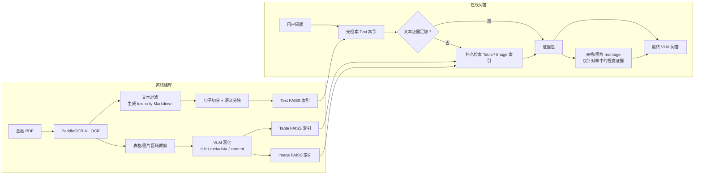

# FinsightRAG

[中文](README.md) | [English](README_EN.md)

## 项目简介

FinsightRAG 是一个面向金融文档的轻量、可复现的多模态 RAG 基线项目，基于 [MultiFinRAG](https://arxiv.org/abs/2506.20821) 的核心思想进行工程化实现与扩展，用于从财报、年报、10-Q、10-K 等长篇 PDF 文档中检索并融合文本、表格与图表证据，生成可追溯、可验证的问答结果。

本项目不是 MultiFinRAG 的官方复现，而是参考其金融多模态问答中的核心证据检索思路，构建一个更偏工程落地、本地可复现和便于展示的金融文档问答基线系统。

---

## 核心特性

* 使用 **PaddleOCR-VL** 解析金融 PDF，支持页级 OCR 与布局信息保留
* 自动裁剪表格、图片、图表区域，并保留页码、bbox、标题等元数据
* 使用兼容 OpenAI 接口的视觉语言模型对表格和图片进行语义富化
* 分别构建 **文本 / 表格 / 图片** 三路 FAISS 索引
* 支持 **文本优先 + 多模态补充** 的检索策略
* 生成证据包与表格/图片拼图，提升答案可追溯性
* 保存完整查询运行结果，便于调试、复现和项目展示

---

## 流程概览



---

## 环境要求

* Windows 10/11 + PowerShell
  当前脚本主要在 Windows + PowerShell 环境下测试。

* Docker Desktop
  用于运行 PaddleOCR-VL OCR 服务。

* Python 3.10+

* 兼容 OpenAI 接口的视觉语言模型 API
  用于表格/图片富化和最终问答生成。

* 嵌入模型
  默认使用 `BAAI/bge-m3`，向量维度为 1024。

* 推荐 GPU
  从原始 PDF 完整复现时，OCR 和视觉模型调用会明显受益于 GPU。

---

## 安装方式

```powershell
git clone https://github.com/SiruiXiong123/FinsightRAG.git
cd FinsightRAG

python -m venv .venv
.\.venv\Scripts\Activate.ps1

pip install -r requirements.txt
```

复制并修改配置文件：

```powershell
copy config.example.yaml config.yaml
```

主要配置项如下：

```yaml
vision_binding_host: "<your-vlm-api-host>"
vision_binding_api_key: "<your-api-key>"
vision_model: "<your-vlm-model>"

embedding_model: "BAAI/bge-m3"

indexing:
  index_root: "indexes"

retrieval:
  text_threshold: 0.70
  table_threshold: 0.65
  image_threshold: 0.55
  min_text_chunks: 6
```

---

## 快速开始

仓库已包含 `MorganStanleyQ10` 的预构建索引和样例 OCR/裁剪/富化产物，可以直接运行查询链路：

```powershell
$Query = @'
As of March 31, 2026, what was the total amount of Wealth Management loans for U.S. Bank Subsidiaries, and how was it divided between Residential real estate and Securities-based lending and Other?
'@

python .\scripts\4_run_query_pipeline.py `
  --document-id MorganStanleyQ10 `
  --query $Query.Trim() `
  --output-dir .\runs\query_pipeline\wealth_management_loans_recheck
```

预期答案：

```text
As of March 31, 2026, total Wealth Management loans were $186.3 billion, including $73.4 billion in Residential real estate loans and $112.9 billion in Securities-based lending and Other loans.
```

---

## 示例结果

完整流程已在 `MorganStanleyQ10.pdf` 上测试通过。

| 项目        |                       结果 |
| --------- | -----------------------: |
| PDF 页数    |                       77 |
| 文本块数量     |                      488 |
| 表格记录数量    |                      208 |
| 图片/图表记录数量 |                        9 |
| 表格富化成功率   |                208 / 208 |
| 图片富化成功率   |                    9 / 9 |
| 示例查询检索结果  | text=0, table=4, image=0 |
| 最终视觉输入    |                  1 张表格拼图 |

示例输出目录：

```text
runs/query_pipeline/wealth_management_loans_recheck/
```

该示例触发了多模态补充检索，并使用检索到的表格证据生成最终答案。

---

## 重建索引

如果 OCR、文本分块、表格/图片裁剪和视觉语言模型富化结果已经存在，可以直接重建 FAISS 索引：

```powershell
python .\scripts\2_build_document_indexes.py `
  --document-id MorganStanleyQ10 `
  --source-file .\data\input\MorganStanleyQ10.pdf `
  --ocr-output-dir .\data\output
```

默认索引输出目录：

```text
indexes/MorganStanleyQ10/
```

---

## 完整复现流程

完整复现会从原始 PDF 开始，耗时较长，需要 Docker、GPU 和可用的视觉语言模型 API。

### 1. 运行 PaddleOCR-VL

```powershell
powershell -ExecutionPolicy Bypass -File .\scripts\1_run_paddleocr.ps1 `
  --file /workspace/work/data/input/MorganStanleyQ10.pdf `
  --output-dir /workspace/work/data/output
```

### 2. 生成纯文本 Markdown

```powershell
python .\scripts\1_generate_text_only_md.py `
  --ocr-output-dir .\data\output `
  --output-dir .\data\output
```

### 3. 生成文本分块

```powershell
python .\scripts\1_text_chunking.py `
  --text-md-file .\data\output\MorganStanleyQ10_text.md `
  --page-json-dir .\data\output\MorganStanleyQ10 `
  --sentence-output-dir .\data\output `
  --chunk-output-dir .\data\output
```

### 4. 裁剪表格和图片资产

```powershell
python .\scripts\1_generate_assets.py `
  --ocr-output-dir .\data\output `
  --pdf-dir .\data\input `
  --output-dir .\data\output
```

### 5. 富化表格和图片资产

```powershell
python .\scripts\1_enrich_assets.py `
  --pdf-name MorganStanleyQ10 `
  --ocr-output-dir .\data\output `
  --output-dir .\data\output
```

### 6. 构建 FAISS 索引

```powershell
python .\scripts\2_build_document_indexes.py `
  --document-id MorganStanleyQ10 `
  --source-file .\data\input\MorganStanleyQ10.pdf `
  --ocr-output-dir .\data\output
```

### 7. 运行查询链路

```powershell
python .\scripts\4_run_query_pipeline.py `
  --document-id MorganStanleyQ10 `
  --query "你的问题" `
  --output-dir .\runs\query_pipeline\demo
```

---

## 项目结构

```text
FinsightRAG/
├── data/
│   ├── input/             # 原始 PDF 文件
│   └── output/            # OCR 输出、文本分块、裁剪资产和富化结果
├── indexes/               # 每个文档对应的 FAISS 索引
├── runs/
│   └── query_pipeline/    # 查询输出和证据包
├── scripts/               # 流水线脚本
├── src/                   # 核心实现代码
├── config.yaml            # 运行配置文件
├── requirements.txt
├── README_EN.md
└── README.md
```

---

## 输出目录

主要输出位置如下：

```text
data/output/                         # OCR、Markdown、文本分块、裁剪资产和富化结果
indexes/{document_id}/               # 文本/表格/图片 FAISS 索引和元数据
runs/query_pipeline/{run_name}/      # 检索结果、证据包、拼图和最终答案
```

每次查询运行可能包含：

* 检索到的证据记录
* 证据包 JSON
* 表格/图片拼图
* 最终问答结果
* 运行摘要

---

## 参考文献

Chinmay Gondhalekar, Urjitkumar Patel, Fang-Chun Yeh.
**MultiFinRAG: An Optimized Multimodal Retrieval-Augmented Generation (RAG) Framework for Financial Question Answering**.
arXiv preprint arXiv:2506.20821, 2025.
[arXiv](https://arxiv.org/abs/2506.20821) | [PDF](https://arxiv.org/pdf/2506.20821)
