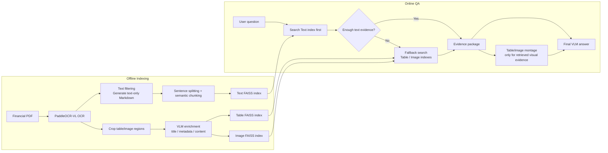

# FinsightRAG

[English](README_EN.md) | [中文](README.md)

## Project Overview

FinsightRAG is a lightweight, reproducible multimodal RAG baseline for financial documents. Inspired by the core ideas of [MultiFinRAG](https://arxiv.org/abs/2506.20821), it retrieves and fuses text, table, and chart evidence from long financial PDFs such as earnings reports, annual reports, 10-Q filings, and 10-K filings, then generates traceable and verifiable answers.

This project is not an official reproduction of MultiFinRAG. It is an engineering-oriented baseline that adapts the paper's financial multimodal evidence retrieval ideas into a local, reproducible, and demo-friendly financial document QA system.

---

## Key Features

* Parses financial PDFs with **PaddleOCR-VL**, preserving page-level OCR and layout information
* Crops table, image, and chart regions while keeping metadata such as page number, bbox, and title
* Enriches tables and images with an OpenAI-compatible vision language model
* Builds separate **text / table / image** FAISS indexes
* Supports a **text-first retrieval strategy with multimodal fallback**
* Generates evidence packages and table/image montages for traceable answers
* Saves complete query run outputs for debugging, reproduction, and demos

---

## Pipeline Overview



---

## Requirements

* Windows 10/11 + PowerShell
  The current scripts are mainly tested on Windows with PowerShell.

* Docker Desktop
  Used to run the PaddleOCR-VL OCR service.

* Python 3.10+

* OpenAI-compatible vision language model API
  Used for table/image enrichment and final answer generation.

* Embedding model
  The default embedding model is `BAAI/bge-m3` with 1024-dimensional vectors.

* GPU recommended
  Full reproduction from raw PDFs is much faster with a GPU, especially for OCR and vision model calls.

---

## Installation

```powershell
git clone https://github.com/SiruiXiong123/FinsightRAG.git
cd FinsightRAG

python -m venv .venv
.\.venv\Scripts\Activate.ps1

pip install -r requirements.txt
```

Copy and edit the configuration file:

```powershell
copy config.example.yaml config.yaml
```

Main configuration fields:

```yaml
vision_binding_host: "<your-vlm-api-host>"
vision_binding_api_key: "<your-api-key>"
vision_model: "<your-vlm-model>"

embedding_model: "BAAI/bge-m3"

indexing:
  index_root: "indexes"

retrieval:
  text_threshold: 0.70
  table_threshold: 0.65
  image_threshold: 0.55
  min_text_chunks: 6
```

---

## Quick Start

The repository includes the prebuilt `MorganStanleyQ10` index and sample OCR/cropping/enrichment artifacts, so you can run the query pipeline directly:

```powershell
$Query = @'
As of March 31, 2026, what was the total amount of Wealth Management loans for U.S. Bank Subsidiaries, and how was it divided between Residential real estate and Securities-based lending and Other?
'@

python .\scripts\4_run_query_pipeline.py `
  --document-id MorganStanleyQ10 `
  --query $Query.Trim() `
  --output-dir .\runs\query_pipeline\wealth_management_loans_recheck
```

Expected answer:

```text
As of March 31, 2026, total Wealth Management loans were $186.3 billion, including $73.4 billion in Residential real estate loans and $112.9 billion in Securities-based lending and Other loans.
```

---

## Demo Result

The full pipeline has been tested on `MorganStanleyQ10.pdf`.

| Item | Result |
| --- | ---: |
| PDF pages | 77 |
| Text chunks | 488 |
| Table records | 208 |
| Image/chart records | 9 |
| Table enrichment success rate | 208 / 208 |
| Image enrichment success rate | 9 / 9 |
| Sample retrieval result | text=0, table=4, image=0 |
| Final visual input | 1 table montage |

Sample output directory:

```text
runs/query_pipeline/wealth_management_loans_recheck/
```

This sample triggers multimodal fallback retrieval and uses retrieved table evidence to generate the final answer.

---

## Rebuild Index

If OCR outputs, text chunks, cropped table/image assets, and VLM enrichment results already exist, you can rebuild the FAISS indexes directly:

```powershell
python .\scripts\2_build_document_indexes.py `
  --document-id MorganStanleyQ10 `
  --source-file .\data\input\MorganStanleyQ10.pdf `
  --ocr-output-dir .\data\output
```

Default index output directory:

```text
indexes/MorganStanleyQ10/
```

---

## Full Reproduction

Full reproduction starts from the raw PDF and can be slow. It requires Docker, a GPU, and an available vision language model API.

### 1. Run PaddleOCR-VL

```powershell
powershell -ExecutionPolicy Bypass -File .\scripts\1_run_paddleocr.ps1 `
  --file /workspace/work/data/input/MorganStanleyQ10.pdf `
  --output-dir /workspace/work/data/output
```

### 2. Generate Text-Only Markdown

```powershell
python .\scripts\1_generate_text_only_md.py `
  --ocr-output-dir .\data\output `
  --output-dir .\data\output
```

### 3. Generate Text Chunks

```powershell
python .\scripts\1_text_chunking.py `
  --text-md-file .\data\output\MorganStanleyQ10_text.md `
  --page-json-dir .\data\output\MorganStanleyQ10 `
  --sentence-output-dir .\data\output `
  --chunk-output-dir .\data\output
```

### 4. Crop Table and Image Assets

```powershell
python .\scripts\1_generate_assets.py `
  --ocr-output-dir .\data\output `
  --pdf-dir .\data\input `
  --output-dir .\data\output
```

### 5. Enrich Table and Image Assets

```powershell
python .\scripts\1_enrich_assets.py `
  --pdf-name MorganStanleyQ10 `
  --ocr-output-dir .\data\output `
  --output-dir .\data\output
```

### 6. Build FAISS Indexes

```powershell
python .\scripts\2_build_document_indexes.py `
  --document-id MorganStanleyQ10 `
  --source-file .\data\input\MorganStanleyQ10.pdf `
  --ocr-output-dir .\data\output
```

### 7. Run the Query Pipeline

```powershell
python .\scripts\4_run_query_pipeline.py `
  --document-id MorganStanleyQ10 `
  --query "your question" `
  --output-dir .\runs\query_pipeline\demo
```

---

## Project Structure

```text
FinsightRAG/
├── data/
│   ├── input/             # Raw PDF files
│   └── output/            # OCR outputs, text chunks, cropped assets, and enrichment results
├── indexes/               # Per-document FAISS indexes
├── runs/
│   └── query_pipeline/    # Query outputs and evidence packages
├── scripts/               # Pipeline scripts
├── src/                   # Core implementation
├── config.yaml            # Runtime configuration file
├── requirements.txt
├── README_EN.md
└── README.md
```

---

## Outputs

Main output locations:

```text
data/output/                         # OCR, Markdown, text chunks, cropped assets, and enrichment results
indexes/{document_id}/               # Text/table/image FAISS indexes and metadata
runs/query_pipeline/{run_name}/      # Retrieval results, evidence package, montage, and final answer
```

Each query run may include:

* Retrieved evidence records
* Evidence package JSON
* Table/image montages
* Final QA result
* Run summary

---

## References

Chinmay Gondhalekar, Urjitkumar Patel, Fang-Chun Yeh.
**MultiFinRAG: An Optimized Multimodal Retrieval-Augmented Generation (RAG) Framework for Financial Question Answering**.
arXiv preprint arXiv:2506.20821, 2025.
[arXiv](https://arxiv.org/abs/2506.20821) | [PDF](https://arxiv.org/pdf/2506.20821)
