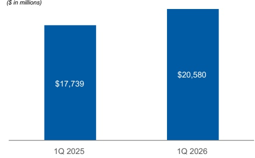
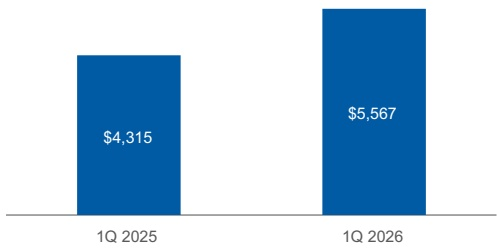
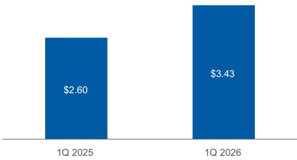

## Management's Discussion and Analysis

## Executive Summary

## Overview of Financial Results

## Consolidated Results—Three Months Ended March 31, 2026

• The Firm reported net revenues and pre-tax income of $20.6 billion and $7.0 billion, respectively.

• The Firm delivered ROE of 21.0% and ROTCE of 27.1% (see “Selected Non-GAAP Financial Information” herein).

- The expense efficiency ratio was 65% for the first quarter, demonstrating operating leverage while continuing to invest in our businesses.

• At March 31, 2026, the Firm's Standardized Common Equity Tier 1 capital ratio was 15.1%.

- Institutional Securities reported net revenues of $10.7 billion, primarily reflecting strong results in our Markets business and higher Investment Banking revenues driven by Advisory.

• Wealth Management delivered net revenues of $8.5 billion and a pre-tax margin of 30.4% reflecting strong Asset management revenues, increased net interest income, and higher Transactional revenues. The business added net new assets of $118 billion and fee-based asset flows were $54 billion.

- Investment Management reported net revenues of $1.5 billion, primarily driven by asset management fees on higher average AUM. The quarter included positive long-term net flows of $3.3 billion.

During the first quarter of 2026, certain Investment Management products were reclassified among asset classes to more closely align reporting with underlying investment strategies. For further information see “Business Segments—Investment Management—Assets Under Management or Supervision Rollforwards” herein.

Net Revenues ($ in millions)

Net Income Applicable to Morgan Stanley ($ in millions)

Earnings per Diluted Common Share

We reported net revenues of $20.6 billion in the quarter ended March 31, 2026 (“current quarter,” or “1Q 2026”), which increased by 16% compared with $17.7 billion in the quarter ended March 31, 2025 (“prior year quarter,” or “1Q 2025”). Net income applicable to Morgan Stanley was $5.6 billion in the current quarter, which increased by 29% compared with $4.3 billion in the prior year quarter. Diluted earnings per common share was $3.43 in the current quarter, which increased by 32% compared with $2.60 in the prior year quarter.

