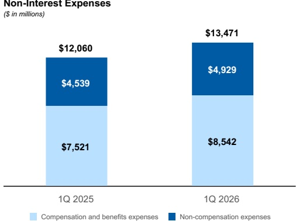
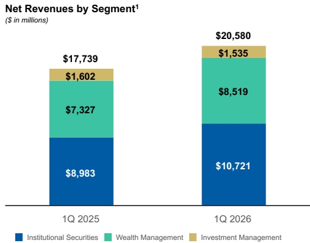
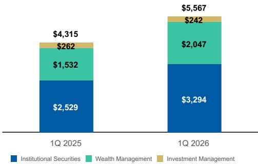

Management's Discussion and Analysis

• Compensation and benefits expenses of $8,542 million in the current quarter increased 14% from the prior year quarter, primarily due to an increase in the formulaic payout to Wealth Management advisors and higher discretionary incentive compensation within Institutional Securities, both on higher revenues.

During the current quarter, as a result of a March workforce management action, we recognized severance costs of $178 million in Compensation and benefits expense. The workforce management action was related to an effort to improve operational efficiency and manage performance, rather than a change in strategy or exit of businesses. The action occurred across our business segments and geographic regions and impacted approximately 2% of our global workforce at that time. We recorded severance costs of $94 million in the Institutional Securities business segment, $61 million in the Wealth Management business segment, and $23 million in the Investment Management business segment. These costs were incurred across all regions, with the majority in the Americas.

## Provision for Credit Losses

- Non-compensation expenses of $4,929 million in the current quarter increased 9% from the prior year quarter, primarily due to higher execution-related expenses.

The Provision for credit losses on loans and lending commitments of $98 million in the current quarter was primarily related to certain commercial real estate loans and increased macroeconomic uncertainty. The Provision for credit losses on loans and lending commitments in the prior year quarter was $135 million, primarily related to portfolio growth in secured lending facilities and corporate loans, provisions for certain specific loans, including residential real estate loans related to the California wildfires, and deterioration in the macroeconomic outlook.

For further information on the Provision for credit losses, see “Credit Risk” herein.

Business Segment Results

Net Income Applicable to Morgan Stanley by Segment $ ^{1} $ ( in millions)

1. The amounts in the charts represent the contribution of each business segment to the total of the applicable financial category and may not sum to the total presented on top of the bars due to intersegment eliminations. See Note 19 to the financial statements for details of intersegment eliminations.

- Institutional Securities net revenues of $10,721 million in the current quarter increased 19% from the prior year quarter, primarily reflecting strong results in our Markets business on increased client activity and higher Investment Banking results on higher completed M&A transactions within Advisory.

• Wealth Management net revenues of $8,519 million in the current quarter increased 16% from the prior year quarter, primarily reflecting higher Asset management revenues on higher market levels and the cumulative impact of positive fee-based flows, increased Net interest income and higher Transactional revenues on strong client activity.

- Investment Management net revenues of $1,535 million in the current quarter decreased 4% from the prior year quarter, primarily reflecting lower accrued interest in our private funds, partially offset by higher Asset management and related fees driven by higher average