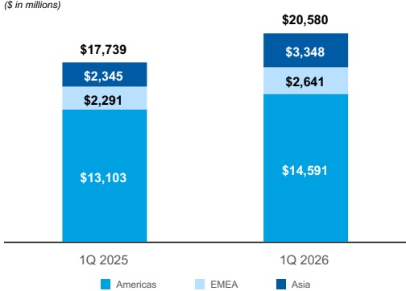

## Management's Discussion and Analysis

AUM on higher market levels and the cumulative impact of positive long-term net flows.

Net Revenues by Region $ ^{1} $

- Americas net revenues increased 11% in the current quarter compared with the prior year quarter, driven by higher Asset management revenues within the Wealth Management business segment and higher Investment Banking and Fixed Income results within the Institutional Securities business segment.

1. For a discussion of how the geographic breakdown of net revenues is determined, see Note 22 to the financial statements in the 2025 Form 10-K.

- EMEA net revenues increased 15% in the current quarter compared with the prior year quarter, primarily driven by higher results in our Markets business within the Institutional Securities business segment.

- Asia net revenues increased 43% in the current quarter compared with the prior year quarter, primarily driven by strong results in Equity within the Institutional Securities business segment.

## Selected Financial Information and Other Statistical Data

<table border=1 style='margin: auto; word-wrap: break-word;'><tr><td style='text-align: center; word-wrap: break-word;'></td><td colspan="2">March 31,</td></tr><tr><td style='text-align: center; word-wrap: break-word;'>in millions, except per share data</td><td style='text-align: center; word-wrap: break-word;'>2026</td><td style='text-align: center; word-wrap: break-word;'>2025</td></tr><tr><td style='text-align: center; word-wrap: break-word;'>Consolidated results</td><td style='text-align: center; word-wrap: break-word;'></td><td style='text-align: center; word-wrap: break-word;'></td></tr><tr><td style='text-align: center; word-wrap: break-word;'>Net revenues</td><td style='text-align: center; word-wrap: break-word;'>20,580</td><td style='text-align: center; word-wrap: break-word;'>17,739</td></tr><tr><td style='text-align: center; word-wrap: break-word;'>Earnings applicable to Morgan Stanley common shareholders</td><td style='text-align: center; word-wrap: break-word;'>5,411</td><td style='text-align: center; word-wrap: break-word;'>4,157</td></tr><tr><td style='text-align: center; word-wrap: break-word;'>Earnings per diluted common share</td><td style='text-align: center; word-wrap: break-word;'>3.43</td><td style='text-align: center; word-wrap: break-word;'>2.60</td></tr><tr><td style='text-align: center; word-wrap: break-word;'>Consolidated financial measures</td><td style='text-align: center; word-wrap: break-word;'></td><td style='text-align: center; word-wrap: break-word;'></td></tr><tr><td style='text-align: center; word-wrap: break-word;'>Expense efficiency  $ ratio^{1} $</td><td style='text-align: center; word-wrap: break-word;'>65 %</td><td style='text-align: center; word-wrap: break-word;'>68 %</td></tr><tr><td style='text-align: center; word-wrap: break-word;'>$ ROE^{2} $</td><td style='text-align: center; word-wrap: break-word;'>21.0 %</td><td style='text-align: center; word-wrap: break-word;'>17.4 %</td></tr><tr><td style='text-align: center; word-wrap: break-word;'>$ ROTCE^{2, 3} $</td><td style='text-align: center; word-wrap: break-word;'>27.1 %</td><td style='text-align: center; word-wrap: break-word;'>23.0 %</td></tr><tr><td style='text-align: center; word-wrap: break-word;'>Pre-tax  $ margin^{4} $</td><td style='text-align: center; word-wrap: break-word;'>34 %</td><td style='text-align: center; word-wrap: break-word;'>31 %</td></tr><tr><td style='text-align: center; word-wrap: break-word;'>Effective tax rate</td><td style='text-align: center; word-wrap: break-word;'>19.6 %</td><td style='text-align: center; word-wrap: break-word;'>21.2 %</td></tr><tr><td style='text-align: center; word-wrap: break-word;'>Pre-tax margin by  $ segment^{4} $</td><td style='text-align: center; word-wrap: break-word;'></td><td style='text-align: center; word-wrap: break-word;'></td></tr><tr><td style='text-align: center; word-wrap: break-word;'>Institutional Securities</td><td style='text-align: center; word-wrap: break-word;'>39 %</td><td style='text-align: center; word-wrap: break-word;'>37 %</td></tr><tr><td style='text-align: center; word-wrap: break-word;'>Wealth Management</td><td style='text-align: center; word-wrap: break-word;'>30 %</td><td style='text-align: center; word-wrap: break-word;'>27 %</td></tr><tr><td style='text-align: center; word-wrap: break-word;'>Investment Management</td><td style='text-align: center; word-wrap: break-word;'>18 %</td><td style='text-align: center; word-wrap: break-word;'>20 %</td></tr><tr><td style='text-align: center; word-wrap: break-word;'>in millions, except per share data, worldwide employees and client assets</td><td style='text-align: center; word-wrap: break-word;'>At March 31, 2026</td><td style='text-align: center; word-wrap: break-word;'>At December 31, 2025</td></tr><tr><td style='text-align: center; word-wrap: break-word;'>Average liquidity resources for three months  $ ended^{5} $</td><td style='text-align: center; word-wrap: break-word;'>395,141</td><td style='text-align: center; word-wrap: break-word;'>385,884</td></tr><tr><td style='text-align: center; word-wrap: break-word;'>$ Loans^{6} $</td><td style='text-align: center; word-wrap: break-word;'>306,260</td><td style='text-align: center; word-wrap: break-word;'>289,038</td></tr><tr><td style='text-align: center; word-wrap: break-word;'>Total assets</td><td style='text-align: center; word-wrap: break-word;'>1,581,418</td><td style='text-align: center; word-wrap: break-word;'>1,420,270</td></tr><tr><td style='text-align: center; word-wrap: break-word;'>Deposits</td><td style='text-align: center; word-wrap: break-word;'>427,971</td><td style='text-align: center; word-wrap: break-word;'>415,523</td></tr><tr><td style='text-align: center; word-wrap: break-word;'>Borrowings</td><td style='text-align: center; word-wrap: break-word;'>371,568</td><td style='text-align: center; word-wrap: break-word;'>348,935</td></tr><tr><td style='text-align: center; word-wrap: break-word;'>Common equity</td><td style='text-align: center; word-wrap: break-word;'>104,536</td><td style='text-align: center; word-wrap: break-word;'>101,882</td></tr><tr><td style='text-align: center; word-wrap: break-word;'>Tangible common  $ equity^{3} $</td><td style='text-align: center; word-wrap: break-word;'>81,473</td><td style='text-align: center; word-wrap: break-word;'>79,147</td></tr><tr><td style='text-align: center; word-wrap: break-word;'>Common shares outstanding</td><td style='text-align: center; word-wrap: break-word;'>1,580</td><td style='text-align: center; word-wrap: break-word;'>1,583</td></tr><tr><td style='text-align: center; word-wrap: break-word;'>Book value per common  $ share^{7} $</td><td style='text-align: center; word-wrap: break-word;'>66.18</td><td style='text-align: center; word-wrap: break-word;'>64.37</td></tr><tr><td style='text-align: center; word-wrap: break-word;'>Tangible book value per common  $ share^{3, 7} $</td><td style='text-align: center; word-wrap: break-word;'>51.58</td><td style='text-align: center; word-wrap: break-word;'>50.00</td></tr><tr><td style='text-align: center; word-wrap: break-word;'>Worldwide employees (in thousands)</td><td style='text-align: center; word-wrap: break-word;'>84</td><td style='text-align: center; word-wrap: break-word;'>83</td></tr><tr><td style='text-align: center; word-wrap: break-word;'>Client assets $ ^{8} $ (in billions)</td><td style='text-align: center; word-wrap: break-word;'>9,213</td><td style='text-align: center; word-wrap: break-word;'>9,276</td></tr><tr><td style='text-align: center; word-wrap: break-word;'>Capital  $ Ratios^{9} $</td><td style='text-align: center; word-wrap: break-word;'></td><td style='text-align: center; word-wrap: break-word;'></td></tr><tr><td style='text-align: center; word-wrap: break-word;'>Common Equity Tier 1 capital—Standardized</td><td style='text-align: center; word-wrap: break-word;'>15.1 %</td><td style='text-align: center; word-wrap: break-word;'>15.0 %</td></tr><tr><td style='text-align: center; word-wrap: break-word;'>Tier 1 capital—Standardized</td><td style='text-align: center; word-wrap: break-word;'>16.9 %</td><td style='text-align: center; word-wrap: break-word;'>16.8 %</td></tr><tr><td style='text-align: center; word-wrap: break-word;'>Common Equity Tier 1 capital—Advanced</td><td style='text-align: center; word-wrap: break-word;'>16.1 %</td><td style='text-align: center; word-wrap: break-word;'>16.2 %</td></tr><tr><td style='text-align: center; word-wrap: break-word;'>Tier 1 capital—Advanced</td><td style='text-align: center; word-wrap: break-word;'>18.0 %</td><td style='text-align: center; word-wrap: break-word;'>18.0 %</td></tr><tr><td style='text-align: center; word-wrap: break-word;'>Tier 1 leverage</td><td style='text-align: center; word-wrap: break-word;'>6.1 %</td><td style='text-align: center; word-wrap: break-word;'>6.7 %</td></tr><tr><td style='text-align: center; word-wrap: break-word;'>SLR</td><td style='text-align: center; word-wrap: break-word;'>5.0 %</td><td style='text-align: center; word-wrap: break-word;'>5.4 %</td></tr></table>

1. The expense efficiency ratio represents total non-interest expenses as a percentage of net revenues.

2. ROE and ROTCE represent annualized earnings applicable to Morgan Stanley common shareholders as a percentage of average common equity and average tangible common equity, respectively.

3. Represents a non-GAAP financial measure. See "Selected Non-GAAP Financial Information" herein.

4. Pre-tax margin represents income before provision for income taxes as a percentage of net revenues.

5. For a discussion of Liquidity resources, see "Liquidity and Capital Resources—Balance Sheet—Liquidity Risk Management Framework—Liquidity Resources" herein.

6. Includes loans held for investment, net of ACL, loans held for sale and also includes loans at fair value, which are included in Trading assets in the balance sheet.

7. Book value per common share and tangible book value per common share equal common equity and tangible common equity, respectively, divided by common shares outstanding.

8. Client assets represents the sum of Wealth Management client assets and Investment Management AUM. Certain Wealth Management client assets, totaling $350 billion as of March 31, 2026 and December 31, 2025, are invested in Investment Management products and are therefore also included in Investment Management's AUM.

9. For a discussion of our capital ratios, see "Liquidity and Capital Resources—Regulatory Requirements" herein.