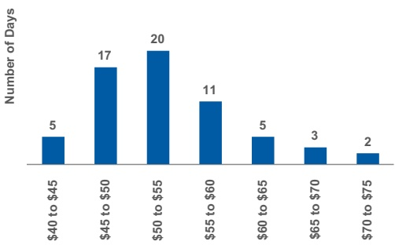
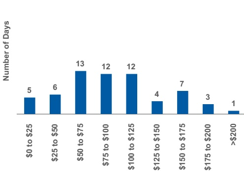

## Risk Disclosures

Daily 95%/One-Day Total Management VaR for the Current Quarter ($ in millions)

Daily Net Trading Revenues for the Current Quarter ($ in millions)

We believe that sensitivity analysis is an appropriate representation of our non-trading risks. The following sensitivity analyses cover substantially all of the non-trading market risk in our portfolio.

Daily net trading revenues include profits and losses from Interest rate and credit spread, Equity price, Foreign exchange rate, Commodity price, and Credit portfolio positions and intraday trading activities for our trading businesses. Certain items such as fees, commissions, net interest income and counterparty default risk are excluded from daily net trading revenues and the VaR model. Revenues required for Regulatory VaR backtesting further exclude intraday trading.

## Non-Trading Risks

## Credit Spread Risk Sensitivity $ ^{1} $

<table border=1 style='margin: auto; word-wrap: break-word;'><tr><td style='text-align: center; word-wrap: break-word;'>At March 31, 2026</td><td style='text-align: center; word-wrap: break-word;'>At December 31, 2025</td></tr><tr><td style='text-align: center; word-wrap: break-word;'>$ Derivatives</td><td style='text-align: center; word-wrap: break-word;'>$ 5 $</td></tr><tr><td style='text-align: center; word-wrap: break-word;'>Borrowings and Deposits carried at fair value</td><td style='text-align: center; word-wrap: break-word;'>58</td></tr></table>

1. Amounts represent the potential gain for each 1 bps widening of our credit spread.

The Wealth Management business segment reflects a substantial portion of our non-trading interest rate risk. Net interest income in the Wealth Management business segment primarily consists of interest income earned on non-trading assets held, including loans and investment securities, as well as margin and other lending on non-bank entities and interest expense incurred on non-trading liabilities, primarily deposits.

Wealth Management Net Interest Income Sensitivity Analysis

<table border=1 style='margin: auto; word-wrap: break-word;'><tr><td style='text-align: center; word-wrap: break-word;'></td><td style='text-align: center; word-wrap: break-word;'>At March 31, 2026</td><td style='text-align: center; word-wrap: break-word;'>At December 31, 2025</td></tr><tr><td style='text-align: center; word-wrap: break-word;'>Basis point change</td><td style='text-align: center; word-wrap: break-word;'></td><td style='text-align: center; word-wrap: break-word;'></td></tr><tr><td style='text-align: center; word-wrap: break-word;'>+200</td><td style='text-align: center; word-wrap: break-word;'>$ 408</td><td style='text-align: center; word-wrap: break-word;'>$ 410</td></tr><tr><td style='text-align: center; word-wrap: break-word;'>+100</td><td style='text-align: center; word-wrap: break-word;'>198</td><td style='text-align: center; word-wrap: break-word;'>209</td></tr><tr><td style='text-align: center; word-wrap: break-word;'>-100</td><td style='text-align: center; word-wrap: break-word;'>(229)</td><td style='text-align: center; word-wrap: break-word;'>(244)</td></tr><tr><td style='text-align: center; word-wrap: break-word;'>-200</td><td style='text-align: center; word-wrap: break-word;'>(502)</td><td style='text-align: center; word-wrap: break-word;'>(542)</td></tr></table>

The previous table presents an analysis of selected instantaneous upward and downward parallel interest rate shocks (subject to a floor of zero percent in the downward scenario) on net interest income over the next 12 months for our Wealth Management business segment. These shocks are applied to our 12-month forecast for our Wealth Management business segment, which incorporates market expectations of interest rates and our forecasted balance sheet and business activity. The forecast includes modeled prepayment behavior, reinvestment of net cash flows from maturing assets and liabilities, and deposit pricing sensitivity to interest rates. These key assumptions are updated periodically based on historical data and future expectations.

We do not manage to any single rate scenario but rather manage net interest income in our Wealth Management business segment across a range of possible outcomes, including non-parallel rate change scenarios. The sensitivity analysis assumes that we take no action in response to these scenarios, assumes there are no changes in other macroeconomic variables normally correlated with changes in interest rates and includes subjective assumptions regarding customer and market re-pricing behavior and other factors.

Our Wealth Management business segment balance sheet is asset sensitive, given assets reprice faster than liabilities, resulting in higher net interest income in higher interest rate scenarios and lower net interest income in lower interest rate scenarios. The level of interest rates may impact the amount of deposits held at the Firm, given competition for deposits from other institutions and alternative cash-equivalent